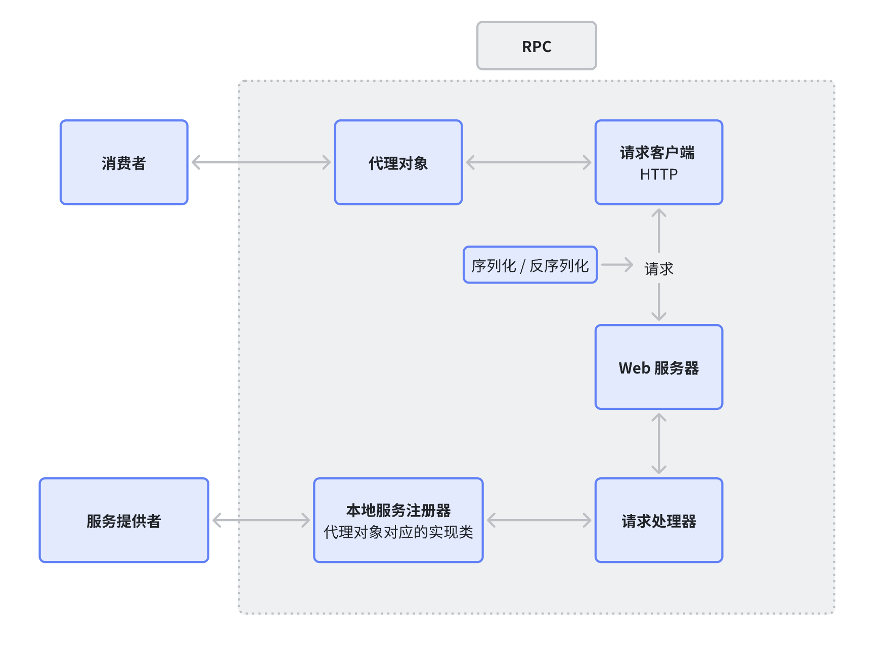

# nx-rpc

RPC(Remote Procedure Call)，即远程过程调用，它是一种用于在分布式系统中进行远程过程调用的协议。通过 RPC
协议，一个程序（**服务消费者**）可以像调用自己程序的方法一样，去调用另一个程序（**服务提供者**
）的接口，而不需要了解数据的传输处理过程、底层网络通信细节等。这些都由 RPC
来辅助完成，由此开发者可以轻松调用远程服务，快速开发分布式系统

如上图所示，RPC 需要实现的就是灰色框中的模块和能力，主要就是服务消费者通过 RPC 调用服务提供者的接口，而不需要关心底层的网络通信细节

但除了图中这些以外，RPC 还需要注意到以下细节：

1. 服务注册发现
2. 负载均衡
3. 容错机制